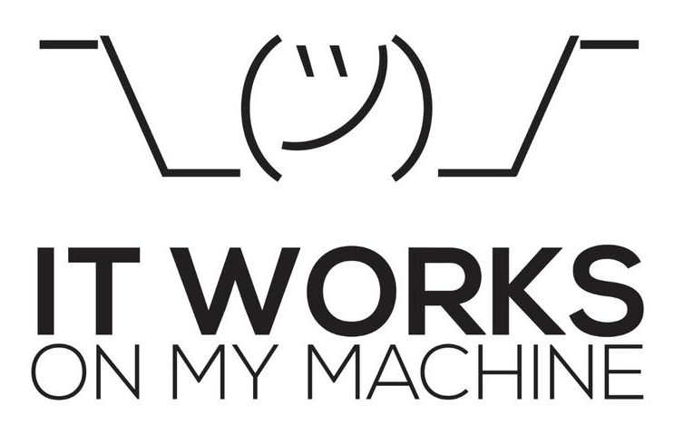

How to avoid the classical..

{ width="400" }

?

The answer is: **CONTAINERIZATION**.

Docker is a platform and tool that enables developers to automate the deployment of applications inside lightweight, portable containers. Containers are a form of virtualization that packages an application and its dependencies together, ensuring consistency across different environments, from development to testing and production.

Here are some key concepts and components of Docker:

- **Containerization:** Containers are lightweight, standalone, and executable packages that include everything needed to run a piece of software, including the code, runtime, libraries, and system tools. Containers isolate applications from their environment, making them portable and consistent across various systems.
- **Docker Engine:** This is the core component of Docker. It is a lightweight and portable runtime that can run containers on various operating systems, including Linux and Windows. The Docker Engine consists of a server, a REST API, and a command-line interface.
- **Docker Image:** An image is a lightweight, standalone, and executable package that includes everything needed to run a piece of software, including the code, a runtime, libraries, environment variables, and config files. Images are used to create containers.
- **Dockerfile:** A Dockerfile is a text file that contains instructions for building a Docker image. It specifies the base image, sets up the environment, installs dependencies, and configures the application.
- **Registry:** Docker images can be stored in registries, which are repositories for sharing and distributing container images. Docker Hub is a popular public registry, and organizations often use private registries to store and manage their proprietary images.
- **Container Orchestration:** Docker can be used in conjunction with container orchestration tools like Kubernetes or Docker Swarm to manage the deployment, scaling, and orchestration of containerized applications in production environments.
- **Portability:** One of Docker's key advantages is its portability. Since containers encapsulate everything an application needs to run, they can run consistently across different environments, reducing the "it works on my machine" problem often encountered in software development.

Docker has become a widely adopted technology in the software development and deployment space due to its ease of use, portability, and the efficiency it brings to the development and deployment lifecycle. It has revolutionized the way applications are packaged, shipped, and deployed, making it easier for developers to build, test, and deploy applications in a more reliable and consistent manner.

## Differences between Docker and Virtual Machines

Docker containers and virtual machines (VMs) are both technologies used for virtualization, but they operate at different levels and have distinct characteristics. Here are the key differences between Docker containers and virtual machines:

| Aspect | Docker Containers | Virtual Machines |
|:-|:-|:-|
| Architecture | Containers share the host operating system's kernel and isolate the application processes from each other. Each container runs in its own user space but uses the host's kernel. | VMs, on the other hand, run a complete operating system, including its own kernel, on top of a hypervisor. Each VM is essentially a full-fledged virtualized computer with its own resources. |
| Resource Efficiency | Containers are more lightweight and share the host OS kernel, which makes them more resource-efficient compared to VMs. Containers can start up quickly and consume fewer system resources. | VMs have more overhead because each VM requires a full operating system and has its own kernel. This makes VMs less resource-efficient than containers. |
| Isolation | Containers provide process-level isolation, meaning that each container runs in its own process space, but they share the same OS kernel. This isolation is generally sufficient for most applications. | VMs provide stronger isolation since each VM runs its own operating system and has its own kernel. This makes VMs a better choice in situations where strong isolation is a critical requirement. |
| Portability | Containers are highly portable because they encapsulate the application and its dependencies, ensuring consistency across different environments. | VMs are less portable due to the larger size and complexity associated with bundling a full operating system with the application. |
| Startup Time | Containers can start up very quickly, typically in seconds, making them well-suited for microservices architectures and dynamic scaling. | VMs generally have longer startup times, often measured in minutes, due to the time required to boot a full operating system. |
| Resource Utilization | Containers share the host OS resources, which can lead to higher density and more efficient resource utilization. | VMs have a higher resource overhead because each VM requires its own set of resources, including memory, disk space, and CPU. |
| Use Cases | Containers are well-suited for microservices architectures, continuous integration/continuous deployment (CI/CD) pipelines, and scenarios where rapid deployment and scalability are crucial. | VMs are suitable for scenarios that require strong isolation, compatibility with various operating systems, and where applications rely on specific OS configurations. |

<figure markdown>
  { width="100%" }
  <figcaption><i>Source: <a href="https://cloudacademy.com/blog/docker-vs-virtual-machines-differences-you-should-know/" target="_blank">Docker vs. Virtual Machines: Differences You Should Know</a></i></figcaption>
</figure>

In summary, Docker containers and virtual machines have different levels of abstraction and are suitable for different use cases. Containers are lightweight, portable, and efficient, making them popular for modern application development and deployment practices. Virtual machines provide stronger isolation and are more suitable for scenarios where running multiple instances of different operating systems is necessary. The choice between Docker containers and virtual machines depends on the specific requirements of the application and the environment in which it will be deployed. To install Docker Engine, see [Install Docker Engine](https://docs.docker.com/engine/install/).

## Creating a Simple Docker

| Command | Description |
|:-|:-|
| `docker run <image>` | Runs a Docker container from an image. |
| `docker ps` | Lists running Docker containers. |
| `docker ps -a` | Lists all Docker containers, both running and stopped. |
| `docker stop <container>` | Stops a running Docker container. |
| `docker rm <container>` | Removes a Docker container. |
| `docker images` | Lists Docker images. |
| `docker rmi <image>` | Removes a Docker image. |
| `docker pull <image>` | Pulls a Docker image from a Docker registry. |
| `docker build -t <tag> .` | Builds a Docker image from a Dockerfile in the current directory. |
| `docker exec -it <container> <command>` | Executes a command in a running Docker container. |
| `docker logs <container>` | Fetches the logs of a Docker container. |

``` python exec="on"
print("Hello Markdown!")
```

<!-- termynal -->

```
> pip install termynal
---> 100%
Installed
```

``` dockerfile
FROM openjdk:17-alpine
VOLUME /tmp
ARG JAR_FILE=target/gateway-0.0.1-SNAPSHOT.jar
COPY ${JAR_FILE} app.jar
ENTRYPOINT ["java","-jar","/app.jar"]
```

[^1]: [Docker vs. Virtual Machines: Differences You Should Know](https://cloudacademy.com/blog/docker-vs-virtual-machines-differences-you-should-know/)


https://docs.docker.com/engine/install/

https://www.docker.com/blog/how-to-use-your-own-registry-2/