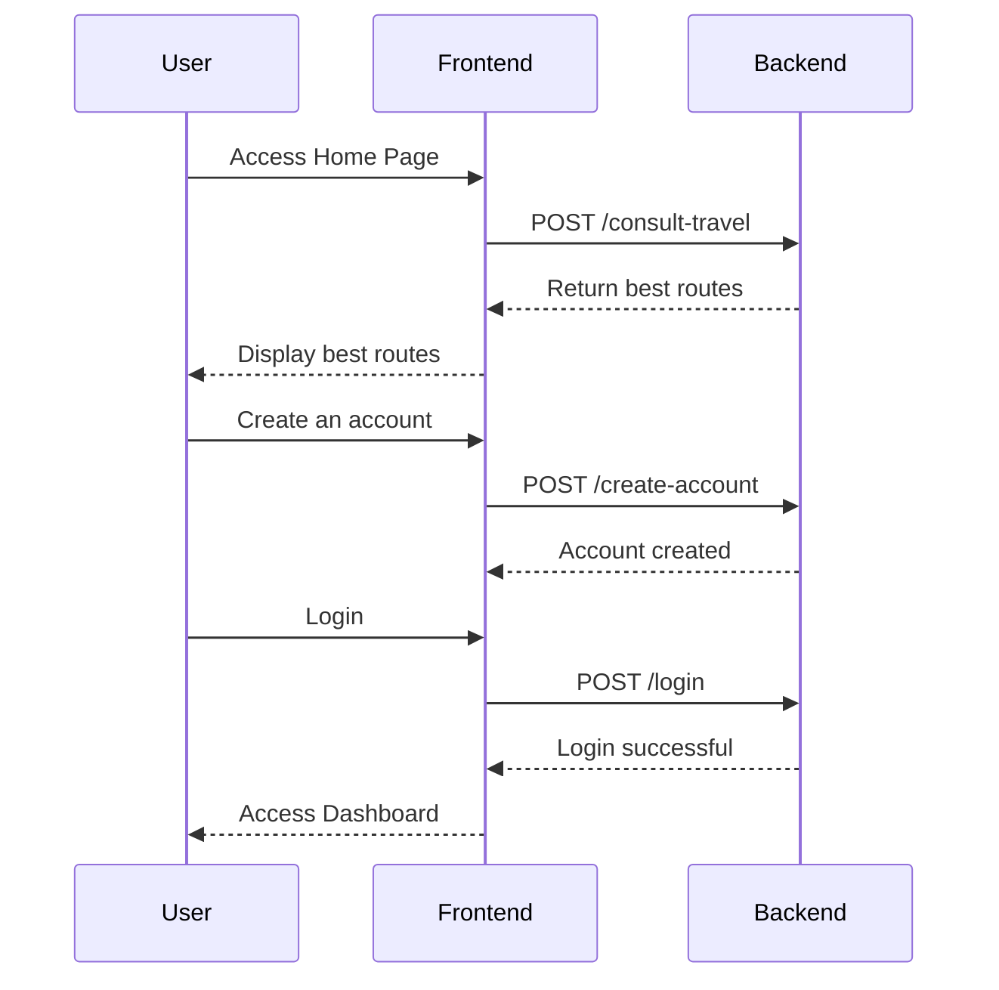
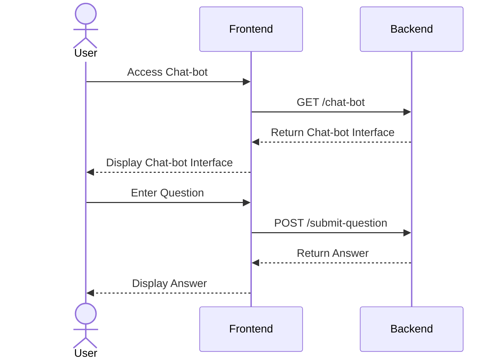

## [ROTA](#rota)
### [Cadastro e Login do Usuário](#cadastro-usuario)

## [INTERAÇÃO](#int)
### [Usuário e Chat-Bot](#user-bot)

  <!--classDiagram
 class Jogador {
    <<class>>
    - Long id
    - String username
    - String tag
    - String playtime
    ...
  }
  class JogadorRepository {
    <<interface>>
    + List<Object[]> findWinPercentage()
  }
  class JogadorRequestDTO {
    <<record>>
    - Long id
    - String username
    - String tag
    ...
  }
  class JogadorController {
    + @GetMapping("/porcen-vitoria")
    + @GetMapping("/porcenVitAgent")
  }
  class JogadorResponeDTO {
    <<record>>
    - Long id
    - String username
    - String tag
  }

  JogadorController <|-- JogadorRepository
  Jogador o-- JogadorRepository
  Jogador o-- JogadorResponeDTO
  Jogador o-- JogadorRequestDTO
  Jogador o-- JogadorController

 -->