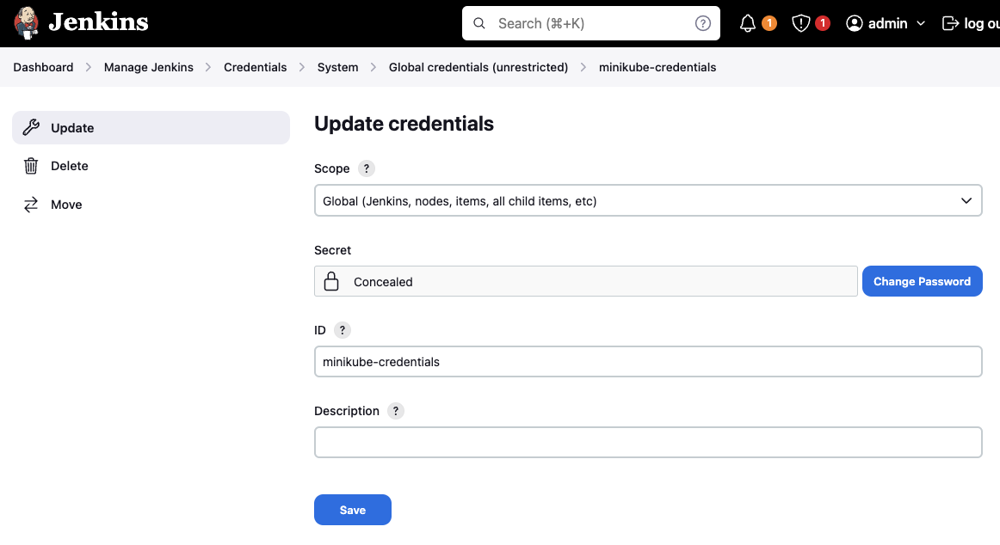
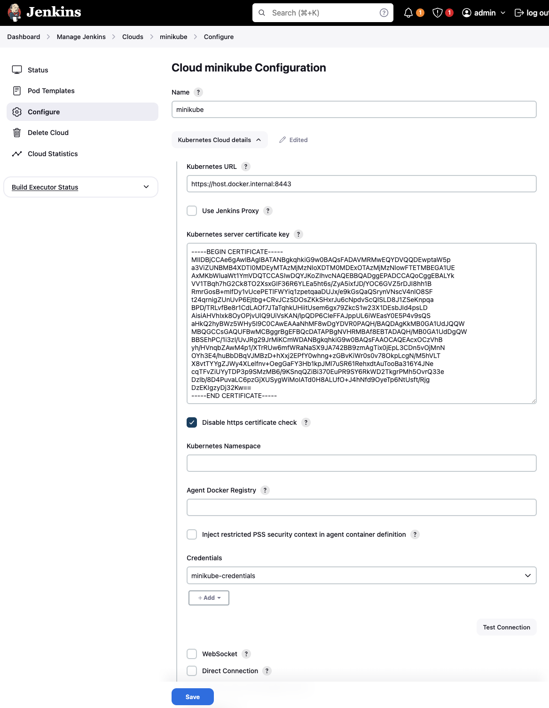

## Minikube

Versão light do kubernetes, para rodar em máquinas locais. [Instalação do Kubernetes](https://minikube.sigs.k8s.io/docs/start/){target="_blank"}.

Para Inicializar o Minikube após a instalação, utilize:

``` shell
minikube start --driver=docker --profile=store
```

``` shell
minikube profile list
```

``` shell
minikube delete --all
```

Dashboard
``` shell
minikube dashboard
```

## Kubectl

Comando cliente de gerenciamento do Kubernetes.

``` shell
kubectl apply -f <filename>
```

``` shell
kubectl get deployments
```

``` shell
kubectl get svc
```

``` shell
kubectl get pods
```

``` shell
kubectl port-forward <pod> 8080:8080
```

``` shell
kubectl exec -it <pod> -- bash
```

``` shell
kubectl delete --all
```

``` shell
kubectl api-resources
```

``` shell
kubectl logs <pod>
```

``` shell
kubectl describe pod <pod>
```

## Services

- ClusterIp: apenas dentro do cluster.

- NodePort: permite exposição de porta para fora do cluster.

- LoadBalance: uma porta para diversas instâncias no cluster.


## Deploying a Postgres 

Crie um novo repositório para armazenar as configurações do banco de dados: [platform.241.store.db](https://github.com/hsandmann/platform.241.store.db){target='_blank'}.

``` tree title="estrutura de diretório sugerida"
store.account
store.db
    k8s
        configmap.yaml
        credentials.yaml
        pv.yaml
        pvc.yaml
        deployment.yaml
        service.yaml
```
=== "configmap.yaml"

    Configuração de conexão do banco

    ``` yaml title='configmap.yaml'
    apiVersion: v1
    kind: ConfigMap
    metadata:
        name: postgres-configmap
        labels:
            app: postgres
    data:
        POSTGRES_HOST: postgres
        POSTGRES_DB: store
    ```

    ``` shell
    kubectl apply -f ./k8s/configmap.yaml
    kubectl get configmap
    ```

=== "credentials.yaml"

    Configuração de acesso ao banco

    ``` yaml title='credentials.yaml'
    apiVersion: v1
    kind: Secret
    metadata:
        name: postgres-credentials
    data:
        POSTGRES_USERNAME: c3RvcmU=
        POSTGRES_PASSWORD: c3RvcmU=
    ```
    
    ``` shell
    kubectl apply -f ./k8s/credentials.yaml
    kubectl get secrets
    ```

    Use encode base64 para ofuscar a senha. Vide: [Base64Encode](https://www.base64encode.org/).

=== "pv.yaml"

    Persistence Volume: espaço alocado no cluster

    ``` yaml title="pv.yaml"
    apiVersion: v1
    kind: PersistentVolume
    metadata:
        name: postgres-volume
        labels:
            type: local
            app: postgres
    spec:
        storageClassName: manual
        capacity:
            storage: 10Gi
        accessModes:
            - ReadWriteMany
        hostPath:
            path: /data/postgresql
    ```

    ``` shell
    kubectl apply -f ./k8s/pv.yaml
    kubectl get pv
    ```

=== "pvc.yaml"

    Persistence Volume Claim: espaço alocado do cluster para o pods.

    ``` yaml title="pvc.yaml"
    apiVersion: v1
    kind: PersistentVolumeClaim
    metadata:
        name: postgres-volume-claim
        labels:
            app: postgres
    spec:
        storageClassName: manual
        accessModes:
            - ReadWriteMany
        resources:
            requests:
                storage: 10Gi
    ```

    ``` shell
    kubectl apply -f ./k8s/pvc.yaml
    kubectl get pvc
    ```

=== "deployment.yaml"

    ``` yaml title="deployment.yaml"
    apiVersion: apps/v1
    kind: Deployment
    metadata:
      name: postgres
    spec:
      replicas: 1
      selector:
        matchLabels:
          app: postgres
      template:
        metadata:
          labels:
            app: postgres
        spec:
          containers:
              - name: postgres
                image: 'postgres:latest'
                imagePullPolicy: IfNotPresent
                ports:
                  - containerPort: 5432
                env:

                  - name: POSTGRES_DB
                    valueFrom:
                      configMapKeyRef:
                        name: postgres-configmap
                        key: POSTGRES_DB

                  - name: POSTGRES_USERNAME
                    valueFrom:
                      secretKeyRef:
                        name: postgres-credentials
                        key: POSTGRES_USERNAME

                  - name: POSTGRES_PASSWORD
                    valueFrom:
                      secretKeyRef:
                        name: postgres-credentials
                        key: POSTGRES_PASSWORD

                volumeMounts:
                  - mountPath: /var/lib/postgresql/data
                    name: postgresdata
          volumes:
              - name: postgresdata
                persistentVolumeClaim:
                  claimName: postgres-volume-claim
    ```

    ``` shell
    kubectl apply -f ./k8s/deployment.yaml
    kubectl get deployments
    kubectl get pods
    ```

=== "service.yaml"

    ``` yaml title="service.yaml"
    apiVersion: v1
    kind: Service
    metadata:
        name: postgres
        labels:
            app: postgres
    spec:
        type: ClusterIP
        ports:
            - port: 5432
        selector:
            app: postgres
    ```

    ``` shell
    kubectl apply -f ./k8s/service.yaml
    kubectl get services
    ```

Acessando o pod do Postgres:

``` shell
kubectl exec -it postgres-<pod-id> -- psql -h localhost -U store --password -p 5432 store
```

Redirecionando porta:
``` shell
kubectl port-forward <pod> 5432:5432
```

## Deploying the Discovery Microservice

``` tree title="discovery"
store.discovery-resource
    src
        main
            resources
                application.yaml
    k8s
        configmap.yaml
        deployment.yaml
        service.yaml
    Dockerfile
    Jenkins
    pom.xml
```

=== "configmap.yaml"

    ``` yaml title="configmap.yaml"
    apiVersion: v1
    kind: ConfigMap
    metadata:
      name: discovery-configmap
      labels:
        app: discovery
    data:
      DISCOVERY_HOST: discovery    
    ```

=== "deployment.yaml"

    ``` yaml title="configmap.yaml"
    apiVersion: apps/v1
    kind: Deployment
    metadata:
      name: discovery
      labels:
        app: discovery
    spec:
      replicas: 1
      selector:
        matchLabels:
          app: discovery
      template:
        metadata:
          labels:
            app: discovery
        spec:
          containers:
            - name: discovery
              image: humbertosandmann/discovery:latest
              ports:
                - containerPort: 8761
    ```

=== "service.yaml"

    ``` yaml title="service.yaml"
    apiVersion: v1
    kind: Service
    metadata:
      name: discovery
      labels:
        app: discovery
    spec:
      type: ClusterIP
      ports:
        - port: 8761
          targetPort: 8761
          protocol: TCP
      selector:
        app: discovery
    ```

## Deploying a Microservice

``` tree title="account"
store.account-resource
    src
        main
            resources
                application.yaml
    k8s
        deployment.yaml
        service.yaml
    Dockerfile
    Jenkins
    pom.xml
```

=== "application.yaml"

    ``` yaml title="application.yaml"
    server:
      port: 8080

    spring:
      application:
        name: account
      datasource:
        url: jdbc:postgresql://${POSTGRES_HOST}:5432/${POSTGRES_DB}
        username: ${POSTGRES_USERNAME:postgres}
        password: ${POSTGRES_PASSWORD:Post123321}
        driver-class-name: org.postgresql.Driver
      flyway:
        baseline-on-migrate: true
        schemas: account
      jpa:
        properties:
          hibernate:
            default_schema: account

    management:
      endpoints:
        web:
          base-path: /account/actuator
            exposure:
              include: [ 'prometheus' ]

    eureka:
      client:
        register-with-eureka: true
        fetch-registry: true
        service-url:
        defaultZone: http://${DISCOVERY_HOST}:8761/eureka/
    ```

    Subir no Git e rodar o Jenkins.

=== "deployment.yaml"

    ``` yaml title="deployment.yaml"
    apiVersion: apps/v1
    kind: Deployment
    metadata:
      name: account
    spec:
      selector:
        matchLabels:
          app: account
      replicas: 1
      template:
        metadata:
          labels:
            app: account
        spec:
          containers:
            - name: account
              image: humbertosandmann/account:latest
              ports:
                - containerPort: 8080
              env:

                - name: DISCOVERY_HOST
                  valueFrom:
                    configMapKeyRef:
                      name: discovery-configmap
                      key: DISCOVERY_HOST

                - name: POSTGRES_HOST
                  valueFrom:
                    configMapKeyRef:
                      name: postgres-configmap
                      key: POSTGRES_HOST

                - name: POSTGRES_DB
                  valueFrom:
                    configMapKeyRef:
                      name: postgres-configmap
                      key: POSTGRES_DB

                - name: POSTGRES_USERNAME
                  valueFrom:
                    secretKeyRef:
                      name: postgres-credentials
                      key: POSTGRES_USERNAME

                - name: POSTGRES_PASSWORD
                  valueFrom:
                    secretKeyRef:
                      name: postgres-credentials
                      key: POSTGRES_PASSWORD
    ```


=== "service.yaml"

    ``` yaml title="service.yaml"
    apiVersion: v1
    kind: Service
    metadata:
      name: account
      labels:
        name: account
    spec:
      type: NodePort
      ports:
        - port: 8080
          targetPort: 8080
          protocol: TCP
      selector:
        app: account
    ```

    ``` shell
    kubectl apply -f ./k8s/service.yaml
    kubectl get services
    ```

``` shell
kubectl apply -f k8s/deployment.yaml
kubectl apply -f k8s/service.yaml  
```

## Deploying using Jenkins

### Creating crendentials for Jenkins to K8s

Criar credentials no Kubernetes para que o Jenkins possa conectar.

``` yaml title="jenkins.yaml"
---
apiVersion: v1
kind: ServiceAccount
metadata:
  name: jenkins
  namespace: default
---

kind: Role
apiVersion: rbac.authorization.k8s.io/v1
metadata:
  name: jenkins
  namespace: default
rules:
- apiGroups: [""]
  resources: ["pods","services"]
  verbs: ["create","delete","get","list","patch","update","watch"]
- apiGroups: ["apps"]
  resources: ["deployments"]
  verbs: ["create","delete","get","list","patch","update","watch"]
- apiGroups: [""]
  resources: ["pods/exec"]
  verbs: ["create","delete","get","list","patch","update","watch"]
- apiGroups: [""]
  resources: ["pods/log"]
  verbs: ["get","list","watch"]
- apiGroups: [""]
  resources: ["secrets"]
  verbs: ["get"]
- apiGroups: [""]
  resources: ["configmaps"]
  verbs: ["create","get","update"]
- apiGroups: [""]
  resources: ["persistentvolumeclaims"]
  verbs: ["create","delete","get","list","patch","update","watch"]
 
---
apiVersion: v1
kind: Secret
metadata:
  name: jenkins-token
  annotations:
    kubernetes.io/service-account.name: jenkins
type: kubernetes.io/service-account-token

---
apiVersion: rbac.authorization.k8s.io/v1
kind: RoleBinding
metadata:
  name: jenkins
  namespace: default
roleRef:
  apiGroup: rbac.authorization.k8s.io
  kind: Role
  name: jenkins
subjects:
- kind: ServiceAccount
  name: jenkins
---
# Allows jenkins to create persistent volumes
# This cluster role binding allows anyone in the "manager" group to read secrets in any namespace.
kind: ClusterRoleBinding
apiVersion: rbac.authorization.k8s.io/v1
metadata:
  name: jenkins-crb
subjects:
- kind: ServiceAccount
  namespace: default
  name: jenkins
roleRef:
  kind: ClusterRole
  name: jenkinsclusterrole
  apiGroup: rbac.authorization.k8s.io
---
kind: ClusterRole
apiVersion: rbac.authorization.k8s.io/v1
metadata:
  # "namespace" omitted since ClusterRoles are not namespaced
  name: jenkinsclusterrole
rules:
- apiGroups: [""]
  resources: ["persistentvolumes"]
  verbs: ["create","delete","get","list","patch","update","watch"]
```

Executar a declaração:
``` shell
kubectl apply -f account.yaml
```

### Recovering the Jenkins' Token

``` shell
kubectl get secrets
```

<!-- termynal -->

```shell
> kubectl get secrets
NAME            TYPE                                  DATA   AGE
jenkins-token   kubernetes.io/service-account-token   3      21s
```

Abrindo o objeto com o token.

``` shell
kubectl describe secrets/jenkins-token
```

<!-- termynal -->

```shell
> kubectl describe secrets/jenkins-token
Name:         jenkins-token
Namespace:    default
Labels:       <none>
Annotations:  kubernetes.io/service-account.name: jenkins
              kubernetes.io/service-account.uid: 0d06d343-fd34-4aff-8396-5dfec5a9e5b6

Type:  kubernetes.io/service-account-token

Data
====
ca.crt:     1111 bytes
namespace:  7 bytes
token:      eyJhbGciOiJSUzI1NiIsImtpZCI6IklqTkZXdEVKcW1iclBrNHBnQzJSX1F6QjFIWDFMX0FvNGV
kNGd2aWFKd00ifQ.eyJpc3MiOiJrdWJlcm5ldGVzL3NlcnZpY2VhY2NvdW50Iiwia3ViZXJuZXRlcy5pby9zZXJ
2aWNlYWNjb3VudC9uYW1lc3BhY2UiOiJkZWZhdWx0Iiwia3ViZXJuZXRlcy5pby9zZXJ2aWNlYWNjb3VudC9zZW
NyZXQubmFtZSI6ImplbmtpbnMtdG9rZW4iLCJrdWJlcm5ldGVzLmlvL3NlcnZpY2VhY2NvdW50L3NlcnZpY2UtY
WNjb3VudC5uYW1lIjoiamVua2lucyIsImt1YmVybmV0ZXMuaW8vc2VydmljZWFjY291bnQvc2VydmljZS1hY2Nv
dW50LnVpZCI6IjBkMDZkMzQzLWZkMzQtNGFmZi04Mzk2LTVkZmVjNWE5ZTViNiIsInN1YiI6InN5c3RlbTpzZXJ
2aWNlYWNjb3VudDpkZWZhdWx0OmplbmtpbnMifQ.XkwD5vwC7CJNDv44PxCAIpLEfVlQbLE6VDNmTOEpFkaoe_x
4ehU8QS8fnTgUz0a_vjUKuXum-PD2vF8Fx_WBsWVAG8BNhXJv79MMbEe7axYT7W91fjsnT0rMqSqzajNjTTDFvP
DQu0KkLzC-UUnlG3RdNHhzxGVnUIA9lIeJuVKnlCXAexPQr6HeX5ggbe-CZO_uMjFZjwBnjLC-IJsIKKaz8I4Cb
Fxz10vAl5SpJ7PadA1iZZEvr_VYhhG42qMqRFLzkrXtWUG0NX8aSitJT0Wk9c54ME13WDZb6MfRXwUWbARu-TLN
56KrPaqtL2dBtRG2EFOn5nVXARI7jPzhjg
```

???+ tip "Try it!!!"

    Abra o token no site [jwt.io](https://jwt.io/){target='_blank'} e verifique seu conteúdo.


### Set up the credential to Jenkins

!!! warning "Before to go ahead"

    Instale os plugins: Kubernetes Cli e Kubernetes pipeline.


Manage Jenkins > Credentials




Instalar certificado digital do Kubernetes para o Jenkins aceitar o `https://`.

``` shell
cat ~/.minikube/ca.crt | base64; echo 
```

<!-- termynal -->

```shell
> cat ~/.minikube/ca.crt | base64; echo
LS0tLS1CRUdJTiBDRVJUSUZJQ0FURS0tLS0tCk1JSURCakNDQWU2Z0F3SUJBZ0lCQVRBTk
Jna3Foa2lHOXcwQkFRc0ZBREFWTVJNd0VRWURWUVFERXdwdGFXNXAKYTNWaVpVTkJNQjRY
RFRJME1ERXlNVEF6TWpNek5sb1hEVE0wTURFeE9UQXpNak16Tmxvd0ZURVRNQkVHQTFVRQ
pBeE1LYldsdWFXdDFZbVZEUVRDQ0FTSXdEUVlKS29aSWh2Y05BUUVCQlFBRGdnRVBBREND
QVFvQ2dnRUJBTFlrClZWMVRCcWg3aEcyQ2s4VE8yWHN4R0lGMzZSNllMRWE1aHQ2cy9aeU
E1aXhmSkQvWU9DNkdWWjVyREpJOGhoMUIKUm1yR29zQittSWZEeTF2VWNlUEVUbEZXWWlx
MXpwZXRxYWFEVUp4L2U5a0dzUWFRU3J5blZOc2NWNG5sTzhTRgp0MjRxcm5pZ1pVblV2UD
ZFanRiZytDUnZKQ3pTRE9zWktrU0h4ckp1NmNOcGR2U2NRbFNMRDhKMVpTZUtucHFhCkJQ
RC9UUkx2ZkJlOHIxQ2RMQU9mN0pUYVRxaGtVSGlpdFVzZW02Z3g3OVprY1MxdzIzWDFERX
NiSklkNHBzTEQKQWlzaUFIVmhJeGs4T3lPUGp2VWxROVVpVnNLQU4vbHBRRFA2Q0llRkZB
SnBwVUw2aVdFYXNZMEU1UDR2OXNRUwphSGtRMmh5Qld6NVdIeTVJOUMwQ0F3RUFBYU5oTU
Y4d0RnWURWUjBQQVFIL0JBUURBZ0trTUIwR0ExVWRKUVFXCk1CUUdDQ3NHQVFVRkJ3TUNC
Z2dyQmdFRkJRY0RBVEFQQmdOVkhSTUJBZjhFQlRBREFRSC9NQjBHQTFVZERnUVcKQkJTRW
hQQy8xaTN6SS9VdkpSZzI5SnJNaUtDbVdEQU5CZ2txaGtpRzl3MEJBUXNGQUFPQ0FRRUFj
eE9DelZoQgp5aC9IVm5xYlpBd000cDEvWFRyUlV3Nm1mV1JhTmFTWDlKQTc0MkJCOXptQW
dUaXgwakVwTDNDRG41dk9qTW5OCk9ZaDNFNC9odUJiREJxVkpNQnpEK2hYeGoyRVBmWTB3
aG5nK3pHQnZLaVdyMHMwdjc4T2twTGNnTi9NNWhWTFQKWDh2dFRZWWdaSld5NFhMZWxmbn
YrT2VnR2FGWTNIYjFrcEpNbDd1U1I2MVJlaHhkdEF1VG9vQmEzMTZZNEpOZQpjcVRGdlpp
VVl5VERQM3A5U016TUI2LzlLU25xUVppQmkzNzBFdVBSOVNZNlJrV0QyVGtnclBNaDVPdn
JRMzNlCkR6bGIvOEQ0UHV2YUxDNnB6R2pYVVN5Z1dpTW9JQVRkMEg4QUxVZk8rSjRoTmZk
OU95ZVRwNk50VXNmdC9SamcKRHpFS0lnenlEajMyS3c9PQotLS0tLUVORCBDRVJUSUZJQ0
FURS0tLS0tCg==
```

???+ tip "BASE64 -> PEM -> X.509"

    [CyberChef](https://gchq.github.io/CyberChef/){target='_blank'}, verifique o certificado.

Instalar o certificado do Minikube no Jenkins, Manage Jenkins > Clouds




### Updating the Jenkinsfile

Adding the `Deploy on k8s` stage:

```yaml title="Jenkinsfile"
...
    stage('Deploy on k8s') {
        steps {
            withCredentials([ string(credentialsId: 'minikube-credentials', variable: 'api_token') ]) {
                sh 'kubectl --token $api_token --server https://host.docker.internal:55529  --insecure-skip-tls-verify=true apply -f ./k8s/deployment.yaml '
                sh 'kubectl --token $api_token --server https://host.docker.internal:55529  --insecure-skip-tls-verify=true apply -f ./k8s/service.yaml '
            }
        }
    }
...
```


## References:

[Using a Service to Expose Your App](https://kubernetes.io/docs/tutorials/kubernetes-basics/expose/expose-intro/){target='_blank'}

[Install Kubernetes's Tools](https://kubernetes.io/docs/tasks/tools/){target='_blank'}

[How to Deploy Postgres to Kubernetes Cluster](https://www.digitalocean.com/community/tutorials/how-to-deploy-postgres-to-kubernetes-cluster){target='_blank'}

[Spring boot, PostgreSQL and Kubernetes](https://medium.com/@dickanirwansyah/spring-boot-postgresql-kubernetes-e3eb726570bd){target='_blank'}

[Deploy nodejs App in a Minikube Kubernetes using Jenkins CI/CD pipeline](https://medium.com/@devayanthakur/minikube-configure-jenkins-kubernetes-plugin-25eb804d0dec){target='_blank'}
