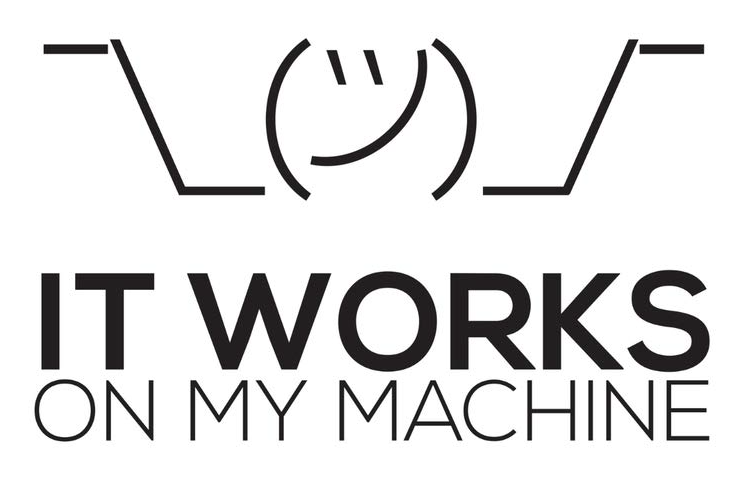

## [Introdução](#introducao)

Para rodar a nossa plataforma sem precisar escutar o tal do:

{ width="400" }

Siga o tutorial abaixo para inicializar cada componente do projeto.

=== "Frontend"
=== "Backend"
=== "Docker"
=== "Raspagem"