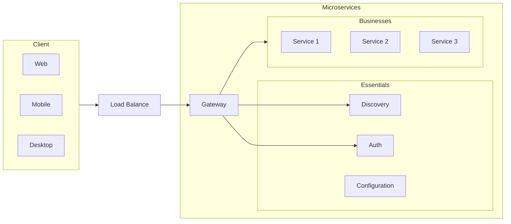

## Microservices Concepts

Microservices, also known as the microservices architecture, is an architectural style that structures an application as a collection of small autonomous services, modeled around a business domain.

Key concepts of microservices include:

- **Single Responsibility**: Each microservice should have a single responsibility and should implement a single business capability.
- **Independence**: Microservices should be able to run and evolve independently of each other. They should be independently deployable and scalable.
- **Decentralization**: Microservices architecture favors decentralized governance. Teams have the freedom to choose the best technology stack that suits their service.
- **Isolation of Failures**: If a microservice fails, it should not impact the availability of other services.
- **Data Isolation**: Each microservice should have its own database to ensure that the services are loosely coupled and can evolve independently.
- **Communication**: Microservices communicate with each other through well-defined APIs and protocols, typically HTTP/REST with [JSON](./security/jwt.md) or gRPC with Protobuf.
- **Infrastructure Automation**: Due to the distributed nature of the microservices architecture, automation of infrastructure is a must. This includes automated provisioning, scaling, and deployment.
- **Observability**: With many different services, it's important to have excellent monitoring and logging to detect and diagnose problems.

### Domain Driven Design

Domain-Driven Design (DDD) is a software development approach that emphasizes collaboration between technical experts and domain experts. The goal is to create software that is a deep reflection of the underlying domain, which is the specific area of business or activity that the software is intended to support.

Key concepts of DDD include:

- **Ubiquitous Language**: A common language established between developers and domain experts, used to describe all aspects of the domain.
- **Bounded Context**: A boundary within which a particular model is defined and applicable.
- **Entities**: Objects that have a distinct identity that persists over time and across different representations.
- **Value Objects**: Objects that are defined by their attributes, not their identity.
- **Aggregates**: Clusters of entities and value objects that are treated as a single unit.
- **Repositories**: They provide a way to obtain references to aggregates.
- **Domain Events**: Events that domain experts care about.
- **Services**: Operations that don't naturally belong to any entity or value object.

By focusing on the domain and domain logic, DDD provides techniques to develop complex systems targeting real-world scenarios. It helps to reduce the complexity by dividing the system into manageable and interconnected parts.

<figure markdown>
  { width="100%" }
  <figcaption><i>Source: <a href="https://github.com/ByteByteGoHq/system-design-101?tab=readme-ov-file#microservice-architecture" target="_blank">System Design 101 - Microservice Architecture</a></i></figcaption>
</figure>

### Design a Microservice Platform

### Containering:

Many microservices implies in many ports, then a complicated environment to manage

<!-- <figure markdown>
  { width="100%" }
  <figcaption><i>Source: <a href="https://github.com/ByteByteGoHq/system-design-101?tab=readme-ov-file#microservice-architecture" target="_blank">System Design 101 - Microservice Architecture</a></i></figcaption>
</figure> -->

## Gateway

## Discovery

## Communication

[^1]: XU, A., [System Design 101](https://github.com/ByteByteGoHq/system-design-101).

[^2]: [Wikipedia - Domain Driven Design](https://en.wikipedia.org/wiki/Domain-driven_design)
