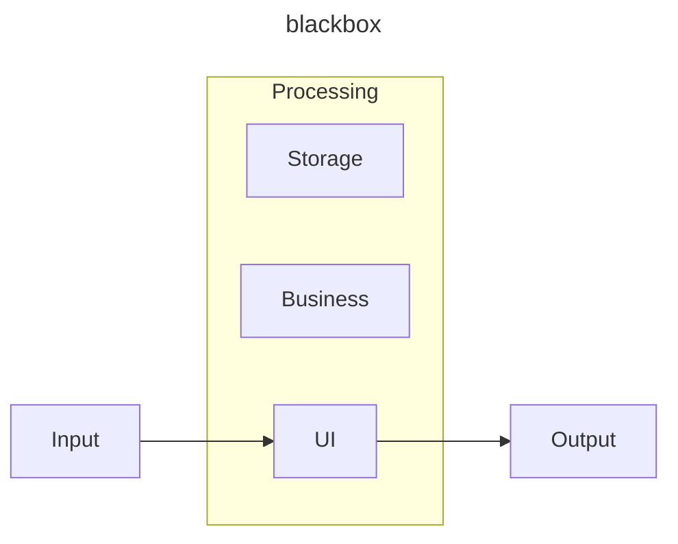
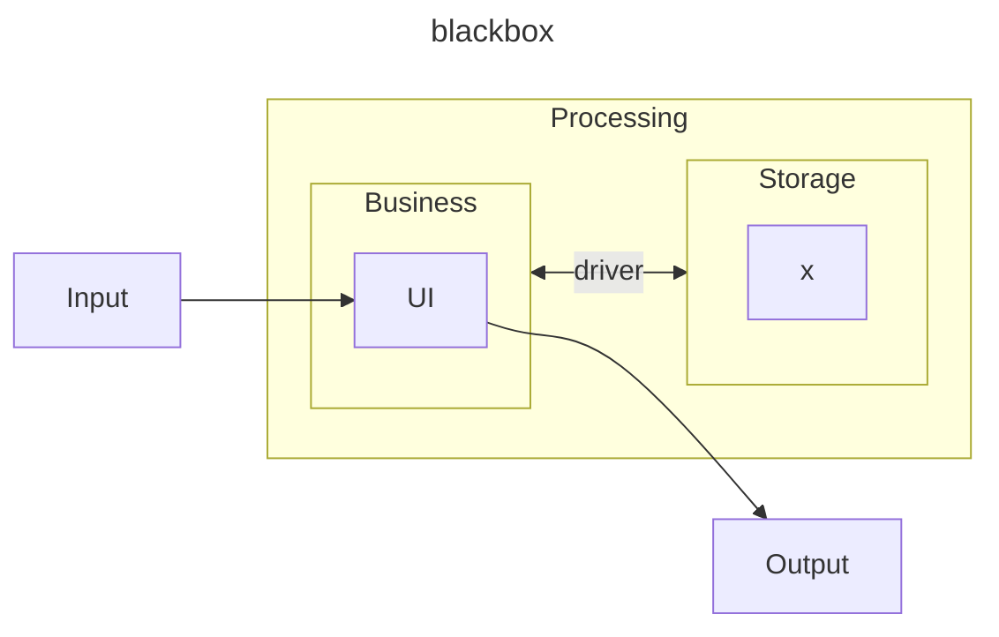
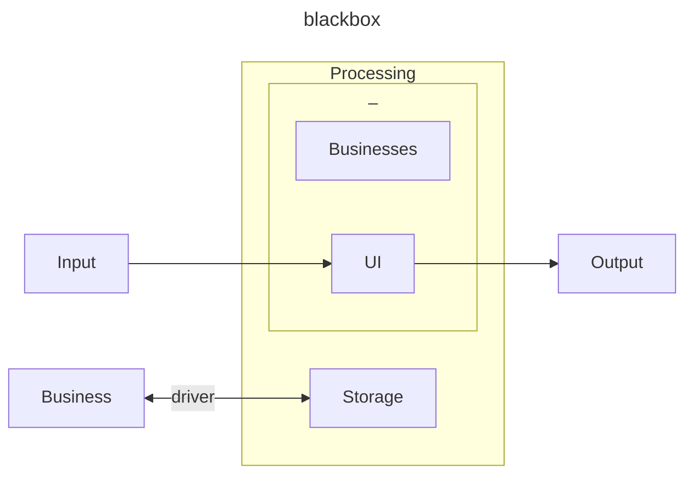
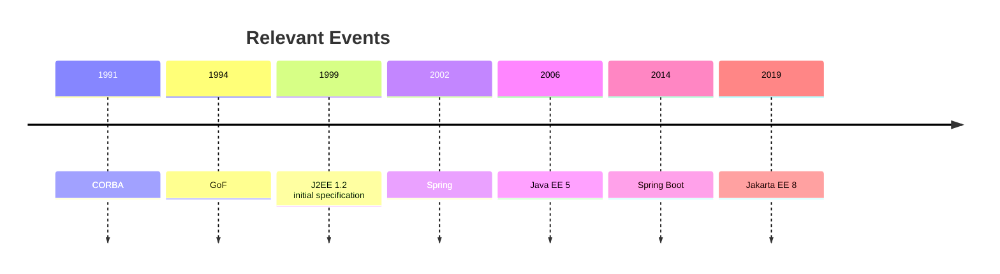

## [Historical Context](#historical-context)

### Single block system

Single block system, following the concept that a system is a *blackbox* schema, so many projects started in a simple single project that is a good choice to raise a system and try to use the initial features. This is a good approach for small and compact systems or for specialist systems where the speed of application matters.

The main disadvantage of this approach is the strong coupling among business, user interface (UI), and storage. The coupling is so strong that there is a mix among all the components, which implies a high cost for maintenance.

### Splitted betweeen data and program

System communicates to only an UI.

Cobol

### Multi-layer approach

#### MVC Pattern

MVC stands for Model-View-Controller. It's a design pattern often used in web development. Here's a brief explanation of each component:

1. **Model**: This is the part of the system that handles the logic for the application data. Often model objects retrieve data (and store data) from a database.

2. **View**: This is the part of the system that handles the display of the data. Most often the views are created from the model data.

3. **Controller**: This is the part of the system that handles user interaction. Typically controllers read data from a view, control user input, and send input data to the model.

The idea behind MVC is that each of these components can be developed and tested independently, which can simplify the overall development process.

## [High-perfomance Architectures](#high-perfomance-architectures)

High-performance architectures refer to the design and configuration of computer systems, networks, and software to achieve optimal speed, responsiveness, throughput, and efficiency. These architectures are specifically tailored to handle large-scale, resource-intensive, and performance-critical workloads. High-performance systems are often employed in scenarios such as data centers, cloud computing environments, scientific computing, financial services, and other applications where speed and efficiency are paramount.

Here are key aspects and principles associated with high-performance architectures:

### [Parallelism and Concurrency](#parallelism-and-concurrency)

- High-performance architectures often leverage parallelism and concurrency to execute multiple tasks simultaneously, improving overall throughput.
- Parallel processing involves dividing a task into smaller sub-tasks that can be processed concurrently, often across multiple processors or cores.
- Concurrency allows multiple tasks to be executed concurrently, even if they are not divided into explicit sub-tasks.

### [Distributed Systems](#distributed-systems)

- Distributing workloads across multiple nodes in a network is a common strategy for achieving high performance.
- Distributed systems allow for horizontal scaling, where additional resources (nodes) can be added to handle increased demand.

### [Optimized Algorithms and Data Structures](#optimized-algorithms-and-data-structures)

- Carefully designed algorithms and data structures are crucial for high performance.
- Efficient algorithms and data structures minimize computational complexity and memory usage.

### [Caching and Memory Optimization](#caching-and-memory-optimization)

- Caching is used to store frequently accessed data in a location that allows faster retrieval, reducing the need to recompute or fetch data from slower storage.
- Memory optimization involves efficiently managing memory usage to minimize latency and improve responsiveness.

### [Scalability](#scalability)

- High-performance architectures are designed to scale horizontally or vertically to accommodate growing workloads.
- Horizontal scalability involves adding more nodes or machines, while vertical scalability involves increasing the resources of individual nodes.

### [Load Balancing](#load-balancing)

- Load balancing ensures that incoming requests are distributed evenly across multiple servers or resources.
- This helps prevent individual components from becoming bottlenecks and ensures optimal resource utilization.

### [Fault Tolerance and Redundancy](#fault-tolerance-and-redundancy)

- High-performance architectures often incorporate redundancy and fault-tolerant mechanisms to ensure continuous operation in the face of hardware failures or network issues.

### [Specialized Hardware](#specialized-hardware)

- In some cases, high-performance architectures may use specialized hardware, such as Graphics Processing Units (GPUs) or Field-Programmable Gate Arrays (FPGAs), to accelerate specific types of computations.

### [Optimized Network Architecture](#optimized-network-architecture)

- Efficient communication between nodes is critical for high performance. Optimized network architectures, low-latency interconnects, and high-bandwidth connections contribute to overall system efficiency.

### [Monitoring and Performance Tuning](#monitoring-and-performance-tuning)

- Continuous monitoring and performance tuning are essential to identify and address bottlenecks, optimize resource utilization, and ensure that the system is operating at peak efficiency.

### [Asynchronous and Event-Driven Design](#asynchronous-and-event-driven-design)

- Asynchronous and event-driven architectures can improve system responsiveness by allowing components to operate independently and respond to events as they occur.

High-performance architectures are tailored to the specific requirements of the applications they support. They often involve a combination of hardware and software optimizations to achieve the desired level of performance for a given workload. It's important to note that designing and maintaining high-performance architectures can be complex and may involve trade-offs between factors such as cost, complexity, and ease of maintenance.

## [CAP theorem](#cap-theorem)

CAP theorem, also known as Brewer's theorem, is a concept in distributed systems that addresses the trade-offs among three fundamental aspects: Consistency, Availability, and Partition Tolerance. It was introduced by computer scientist Eric Brewer in 2000. The CAP theorem suggests that in a distributed system, it is impossible to simultaneously achieve all three of these guarantees. A system can provide at most two out of the three.

Here are the key components of the CAP theorem:

### Consistency (C)

- **Definition:** Every read receives the most recent write or an error. In other words, all nodes in the system see the same data at the same time.
- **Implication:** Ensuring consistency means that any read operation on the system will reflect the most recent write, even in the presence of concurrent operations.

### Availability (A)

- **Definition:** Every request for a read or write operation receives a response without the guarantee that it contains the most recent version of the data.
- **Implication:** An available system can provide a response to read or write requests even if it may not reflect the most recent update. The system is operational and accessible.

### Partition Tolerance (P)

- **Definition:** The system continues to operate even when network partitions occur, meaning that communication between nodes is lost or delayed.
- **Implication:** In a partition-tolerant system, the network can be unreliable or experience failures, and the system can still function.

According to the CAP theorem, a distributed system can prioritize at most two of these three guarantees, and the choice depends on the system's requirements and the nature of the application. Here are three possible scenarios:

* **CA (Consistency and Availability):** In scenarios where network partitions are rare and can be quickly resolved, a system may prioritize consistency and availability. This is common in traditional relational databases where consistency is crucial.
* **CP (Consistency and Partition Tolerance):** In scenarios where the network is unreliable, and partitions are frequent, a system may prioritize consistency and partition tolerance. This is common in systems that require strong consistency, such as many distributed databases.
* **AP (Availability and Partition Tolerance):** In scenarios where network partitions are common, and the system needs to remain operational, a system may prioritize availability and partition tolerance. This is common in systems where high availability and fault tolerance are critical, even if it means sacrificing strong consistency.

<figure markdown>
  { width="80%" }
  <figcaption><i>Source: <a href="https://en.wikipedia.org/wiki/CAP_theorem" target="_blank">Wikipedia - CAP Theorem</a></i></figcaption>
</figure>

It's important to note that the CAP theorem provides a theoretical framework for understanding trade-offs in distributed systems but does not prescribe specific solutions. Different systems may make different choices based on their specific requirements and use cases. Additionally, advancements in distributed systems research have led to the exploration of systems that aim to provide a balance between the three aspects, challenging the strict interpretation of the CAP theorem in some cases.

## [Scalability](#scalability-1)

Scalability in the context of computer systems refers to the ability of a system to handle an increasing amount of work, or its potential to be enlarged to accommodate that growth. There are several types of scalability that are often discussed in the field of computing:

### [Vertical Scalability (Scale-Up)](#vertical-scalability-scale-up)

| *Definition* | Vertical scalability involves adding more resources to a single node or machine in order to increase its capacity. |
| -------------- | ------------------------------------------------------------------------------------------------------------------ |
| *Example*    | Upgrading the CPU, adding more RAM, or increasing storage on a server.                                                     |

| Pros                                               | Cons                                                                   |
| -------------------------------------------------- | ---------------------------------------------------------------------- |
| Simplicity in implementation.                      | There's a limit to how much a single machine can be scaled vertically. |
| it can be cost-effective for certain applications. | It may also lead to downtime during upgrades.                          |

### [Horizontal Scalability (Scale-Out)](#horizontal-scalability-scale-out)

| *Definition* | Horizontal scalability involves adding more nodes or machines to a system, distributing the load across multiple machines. |
| -------------- | -------------------------------------------------------------------------------------------------------------------------- |
| *Example*    | Adding more servers to a web application to handle increased traffic.                                              |

| Pros                                                                       | Cons                                              |
| -------------------------------------------------------------------------- | ------------------------------------------------- |
| Highly scalable, as resources can be easily added by adding more machines. | Requires a distributed architecture.              |
| Can provide better fault tolerance.                                        | Some applications may not be easily parallelized. |

### [Load Balancing](#load-balancing-1)

| *Definition* | Load balancing involves distributing incoming network traffic or workload across multiple servers or resources to optimize resource utilization, maximize throughput, minimize response time, and avoid overloading any single resource. |
|-|-|
| *Example* | A load balancer distributing incoming web requests across multiple web servers. |

| Pros | Cons|
|-|-|
| Improves overall system performance, ensures high availability, and can help with fault tolerance. | Requires additional infrastructure, and the load balancer itself can become a potential bottleneck. |

### [Elastic Scalability](#elastic-scalability)

| *Definition* | Elastic scalability involves dynamically adjusting resources based on demand. Resources are automatically added or removed as needed. |
|-|-|
| *Example* | Cloud computing platforms that can automatically scale the number of virtual machines based on traffic. |

| Pros | Cons|
|-|-|
| Efficient resource utilization, cost-effective as resources are only used when needed. | Requires sophisticated monitoring and management systems. |

### [Database Scalability](#database-scalability)

| *Definition* | Database scalability refers to the ability of a database to handle an increasing amount of data and transactions. |
|-|-|
| **Vertical Database Scalability:** | Adding more resources to a single database server (e.g., increasing CPU, RAM). |
| **Horizontal Database Scalability:** | Distributing the database across multiple servers (e.g., sharding or partitioning). |

| Pros | Cons|
|-|-|
| Can improve performance and handle increased data loads. | Complex to implement, and horizontal scalability may require changes to the database schema. |

### [Caching](#caching)

| *Definition* | Caching involves storing frequently accessed data in a cache to reduce the need to fetch the same data from the original source repeatedly. |
|-|-|
| *Example* | Caching frequently used database queries or the results of computationally expensive operations. |

| Pros | Cons|
|-|-|
| Improves response time, reduces load on backend systems. | May lead to stale data if not managed properly. |

Each type of scalability has its own strengths and weaknesses, and the choice of scalability approach depends on the specific requirements and constraints of the system or application being developed. Often, a combination of these scalability types is employed to achieve optimal performance and resource utilization.

## [Design Patterns](#design-patterns)

A design pattern in software development is a general, reusable solution to a common problem that occurs in a particular context within a software design. It's a template or a best practice that addresses a specific design or programming problem. Design patterns aren't complete solutions by themselves; rather, they provide a blueprint for solving certain types of problems.

The concept of design patterns was popularized by the book "Design Patterns: Elements of Reusable Object-Oriented Software," written by Erich Gamma, Richard Helm, Ralph Johnson, and John Vlissides, often referred to as the "Gang of Four" (GoF)[^1]. The book categorizes design patterns into three main types:

* **Creational Patterns:** These patterns deal with object creation mechanisms, trying to create objects in a manner suitable to the situation. Examples include the Singleton pattern, Factory Method pattern, and Abstract Factory pattern.
* **Structural Patterns:** These patterns focus on the composition of classes or objects. They help in creating a structure of classes and objects, making it easier to form larger structures. Examples include the Adapter pattern, Decorator pattern, and Composite pattern.
* **Behavioral Patterns:** Behavioral patterns are concerned with the interaction and responsibility of objects. They define communication patterns between objects and the responsibility of one object in a given situation. Examples include Observer pattern, Strategy pattern, and Command pattern.

Design patterns provide several benefits in software development:

* **Reusability:** Design patterns promote reusability of solutions to common problems. Once a design pattern is established, it can be applied to similar problems in different parts of the system.
* **Scalability:** Using design patterns can enhance the scalability of a system by providing proven solutions that can be applied as the system grows.
* **Maintainability:** Patterns make code more maintainable by providing a clear and organized structure. Developers familiar with design patterns can understand the overall architecture more easily.
* **Common Vocabulary:** Design patterns establish a common vocabulary for developers. When a developer mentions a particular pattern, others who are familiar with it can quickly understand the solution being implemented.

While design patterns are valuable tools, it's essential to use them judiciously. Not every problem requires a design pattern, and using patterns unnecessarily can lead to overly complex and difficult-to-maintain code. It's important to understand the problem at hand and choose the appropriate design pattern when it genuinely adds value to the solution.

[^1]: GAMMA, E.; HELM, R.; JOHNSON, R., VLISSIDES, J., [Design Patterns: Elements of Reusable Object-Oriented Software](https://www.amazon.com.br/Design-Patterns-Elements-Reusable-Object-Oriented/dp/0201633612/), 1ª ed., Addison-Wesley Professional, 1994.

[^2]: [Wikipedia - CAP Theorem](https://en.wikipedia.org/wiki/CAP_theorem)

[^3]: [Gof](https://springframework.guru/gang-of-four-design-patterns/)