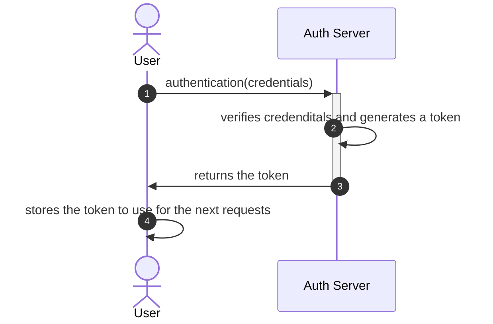
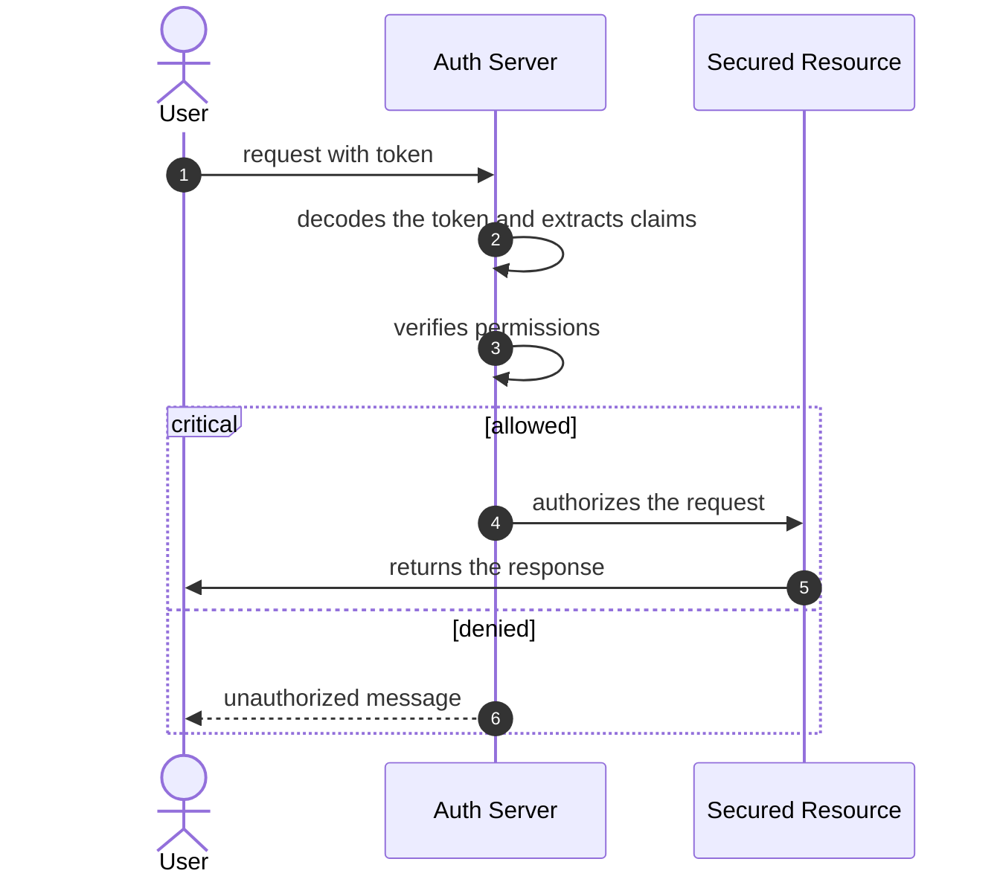
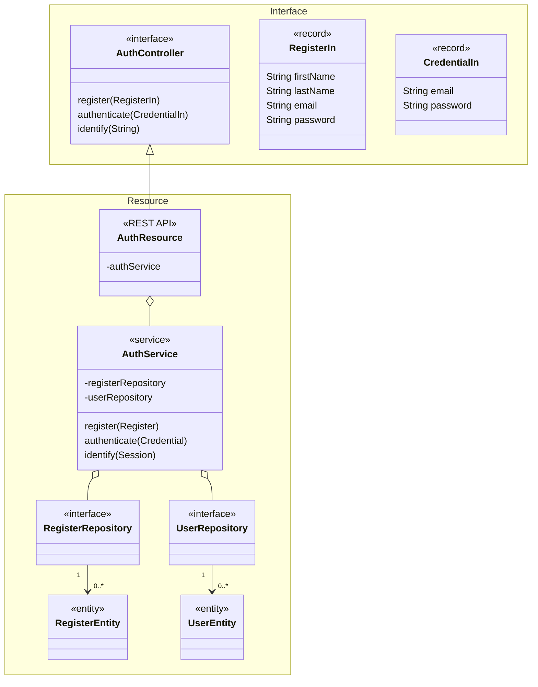

Security is an important aspect of software development. It involves protecting the confidentiality, integrity, and availability of data and resources. Two key concepts in security are authentication and authorization.

### [Authentication](#authentication)

Authentication is the process of verifying the identity of a user or system. It ensures that the user or system is who they claim to be. Common authentication methods include passwords, biometrics, and two-factor authentication. The system checks these credentials against the stored data. If the credentials are valid, the system confirms the user's identity.

In many systems, after successful authentication, the system generates a token. This token is a piece of data that represents the user's authentication session. It's like a digital ticket that proves the user's identity for a certain period of time.

This token is then sent back to the user. The user's client software (like a web browser) stores this token and sends it along with every subsequent request to the server (in case of stateless server). This way, the server knows that the request comes from an authenticated user without needing to ask for the credentials again.

Here's a simplified step-by-step process:

1. The user sends their username and password (or other credentials) to the server;
2. The server verifies the credentials. If they're valid, the server generates a token.
3. The server sends this token back to the user.
4. The user's client software stores this token.
5. For every subsequent request, the client sends this token along with the request.
6. The server checks the token to ensure it's valid and hasn't expired.
7. This token-based authentication process is commonly used in many modern web applications and APIs. It helps maintain the user's session and allows the server to authenticate requests without storing the user's state.

### [Authorization](#authorization)

Authorization is the process of granting or denying access to specific resources or actions based on the authenticated user's privileges. It determines what a user is allowed to do within a system. Authorization can be role-based, where permissions are assigned based on predefined roles, or attribute-based, where permissions are based on specific attributes of the user.

In many systems, the token not only represents the user's identity, but also includes information about their permissions or roles. This is often done using a type of token called a [JSON Web Token (JWT)](./jwt.md), which can include a payload of data.

Here's a simplified step-by-step process:

1. After authentication, the user's client software sends a request to a server. This request includes the token.
2. The server decodes the token and extracts the user's identity and permissions.
3. The server checks whether the user has the necessary permissions for the requested action. This could involve checking the user's roles or other attributes against the requirements for the action.
4. If the user has the necessary permissions, the server allows the action. If not, the server denies the action.

This process allows the server to authorize actions without needing to repeatedly look up the user's permissions. It also allows for stateless servers, as the necessary information is included in every request.

By implementing strong authentication and authorization mechanisms, software systems can ensure that only authorized users have access to sensitive data and functionalities, reducing the risk of unauthorized access and potential security breaches.

As the platform has only one entrace point, it is

JWT is a decentralized 

The point of entrance of API is the gateway, then as suggested by [^5].

## Auth Service

- Responsabilities:
    - Registration:
    - Authentication:
    - Authorization:

Two Maven Projects

- Interfaces

- Implemmentation: resource

## Addtional Material

- [JSON Web Token](./jwt.md)

- <a href="https://www.youtube.com/watch?v=5w-YCcOjPD0" target="_blank">Fernanda Kipper - Autenticação e Autorização com Spring Security e JWT Tokens</a></i>

    [{ width=80% }](https://www.youtube.com/watch?v=5w-YCcOjPD0){:target="_blank"}

[^5]: DELANTHA, R., [Spring Cloud Gateway security with JWT](https://medium.com/@rajithgama/spring-cloud-gateway-security-with-jwt-23045ba59b8a){:target="_blank"}, 2023.
